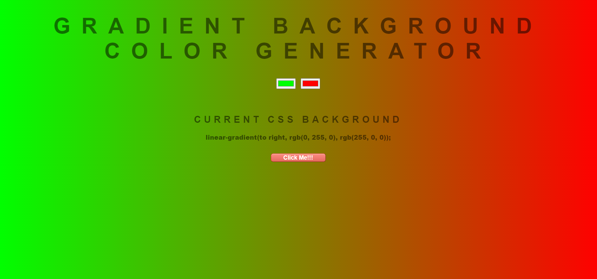

# Gradient Background Color Generator

This is a web-based tool developed using HTML, CSS, and vanilla JavaScript that allows users to easily generate and apply gradient background colors to their web pages. Users can manually choose colors or generate random gradient colors with a single click. The tool also provides the option to copy the CSS code for the generated gradient color. It is a simple yet handy utility for adding visually appealing background colors to the web projects.

## Features

This website includes the following features:

* Choose two colors manually using color pickers.
* Generate a random gradient background color with a single button click.
* Copy the generated CSS code for the generated gradient background color which can be used in any projects.

## Technologies Used

This website is built using the following technologies:

* **HTML:** Used for creating the structure and content of the web page.
* **CSS:** Used for styling the web page and applying the gradient background.
* **JavaScript:** Used for generating random colors, adding interactivity and dynamic functionalities to the website.

These technologies were chosen for their widespread use, compatibility with web browsers, and their ability to create interactive and visually appealing web pages.

## 🛠 Installation and Setup Instructions

1. git clone https://github.com/tawfik575/gradient-background-color-generator.git
2. cd gradient-background-color-generator
3. start index.html

## Contributing

This is a sample project and contributions are not necessary. However, if you would like to contribute to the project, please fork the repository and submit a pull request.

## License

This project is licensed under the MIT License. Feel free to use, modify, and distribute the code as per the terms of the license.

## Contact

If you have any questions, suggestions, or feedback about the project, feel free to contact me at `tawfikbsmrstucse@gmail.com`.
